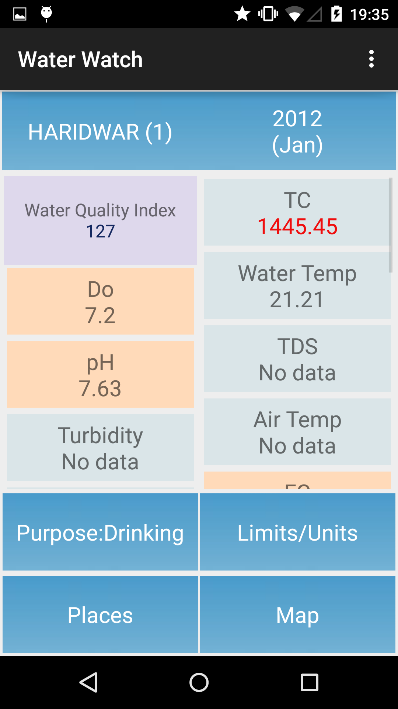

# Water Watch

Water Watch is a novel mobile application that makes water quality data usable and accessible. Using cloud-based data integration and AI methods in the background, it is intended to engage common  public who want to see water condition and safe limits, and their relevance based on different end-use purposes. The tool focuses on one of the most polluted river basins in the world but is widely applicable, is open to others for contribution, and the data is  available for reuse via public APIs.

Water watch uses BlueWater API to fetch water quality data. Water watch is new version of GangaWatch.

## [WaterWatch available on Google play store](https://play.google.com/store/apps/details?id=com.research.waterwatch)

  
  
  

  
  
  

  
  

